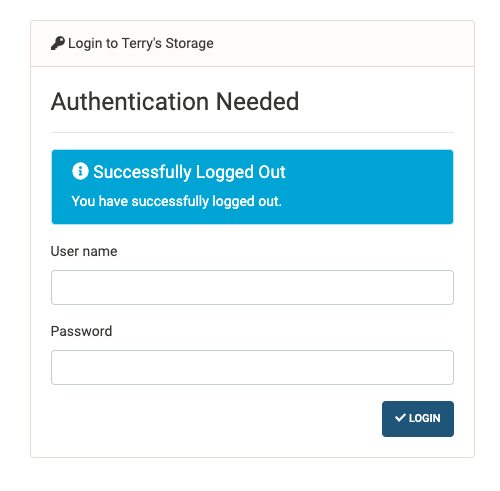

# nginx-simple-login

A lightweight authentication service backend designed to work
with nginx's auth_request.



## Features

- auth_request handler,
- Authentication page,
- Local user database.


## Usage

### Basic

1. Clone this repo.

2. Install this package by `pip install .` (recommended to
 install in a `virtualenv`).
 
3. Create `config.yaml`, follows `config.example.yaml`. A minimal version:
```yaml
user_table: users.yaml
site_name: Restrict Area
logfile: /var/log/nslogin.py
login_life_time: 2592000  # 30 days
```

4. Add user with `nslogin-user` command, e.g.
```bash
nslogin-user --config config.yaml --add --name terry
```

5. Run the daemon of _nslogin_ `nslogind --config config.yaml`.

6. Edit `nginx.conf`, 
```nginx
    location / {
        auth_request /nslogin/auth;  # <<< insert auth_request at locations that require auth
        root   /srv/http;
        index  index.html index.htm;
    }

    location ^~ /nslogin {
        proxy_set_header X-Real-IP $remote_addr;
        proxy_set_header X-Forwarded-For $proxy_add_x_forwarded_for;
        proxy_set_header X-Forwarded-Proto $scheme;

        location /nslogin/auth {
            proxy_pass http://127.0.0.1:8222/auth;
            proxy_pass_request_body off;
            proxy_set_header Content-Length "";
        }

        location /nslogin {
            rewrite /nslogin/(.*) /$1  break;
            proxy_pass http://127.0.0.1:8222;
        }
    }

    error_page 401 = @error401;
    error_page 403 = @error403;

    location @error401 {
        return 302 http://$http_host/nslogin/?redirect=http://$http_host$request_uri;
    }
    location @error403 {
        return 302 http://$http_host/nslogin/403;
    }
```

7. Reload nginx and enjoy.

### Privilege system

Sometimes one may want to restrict one user to access a specific path. This can
be achieved by the privilege system of _nslogin_.

1. Add user with privileges set as
```bash
nslogin-user --config config.yaml --add --name terry --privileges A, B
nslogin-user --config config.yaml --add --name alice --privileges A 
nslogin-user --config config.yaml --add --name bob --privileges B 
```
or, in short,
```bash
nslogin-user -a -n terry -pr A, B
nslogin-user -a -n alice -pr A
nslogin-user -a -n bob -pr B
```

2. Edit `nginx.conf`
```nginx
    location /kitchen {
        auth_request /nslogin/auth/A; # <<< 'A' is the privilege requested to access this location
        root   /srv/http;
        index  index.html index.htm;
    }
    location /bedroom {
        auth_request /nslogin/auth/B; # <<< 'B' is the privilege requested to access this location
        root   /srv/http;
        index  index.html index.htm;
    }
```

This configuration allows `alice` to access `/kitchen` and `bob` to access 
`/bedroom` and grants `terry` the access to both locations.


### Register
Sometimes one would like to allow others to register to the server with a valid
invitation code. Register function can be enabled by putting the following snippet
into the `config.yaml`
```yaml
register:
  enabled: true
  use_invitation_code: true
  dispose_used_invitation_code: true
  invitation_code_file: invitations.yaml
```

where `invitations.yaml` is a list of invitation codes. A handy way to generate
some is
```bash
for i in {1..5}; do echo "- $(dd if=/dev/random bs=9 count=1 2>/dev/null | base64)"; done > invitations.yaml
```


### Escape request URL
When redirection to the login page, the original URL is passed as a `GET` parameter:
```nginx
    location @error401 {
        return 302 http://$http_host/nslogin/?redirect=http://$http_host$request_uri;
    }
```

If `$request_uri` includes other `GET` parameters, they will be ignored. In
order to properly encode `$request_uri`, one needs to install [lua-nginx-module](
https://github.com/openresty/lua-nginx-module) because nginx doesn't have the ability
to deal with complicated rewrite rules. Then use `rewrite_by_lua_block`:
```nginx
    location @error401 {
        rewrite_by_lua_block {
                return ngx.redirect("http://" .. ngx.var.http_host .. "/nslogin/?redirect=" .. ngx.escape_uri(ngx.var.request_uri))
        }
    }
```

